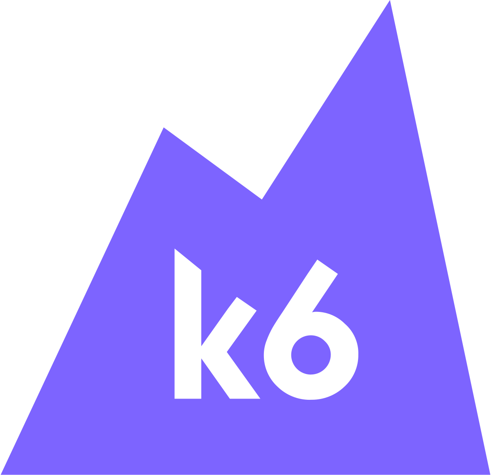
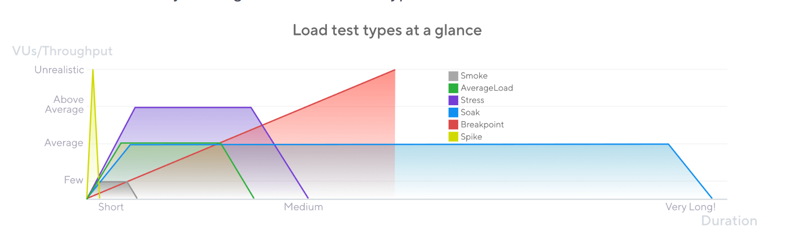

<h1 align="center">Performance Testing Learning Repo with K6</h1>

---

<p align="center">
  
  &nbsp;&nbsp;&nbsp;&nbsp;&nbsp;&nbsp;&nbsp;&nbsp;&nbsp;&nbsp;&nbsp;
  
</p>

---

<br>

<h3 align="center">Types of Performance Testing</h3>

<p align="center">
  
</p>

---

<h2 align="center">Installation</h3>

- K6 engine is written in Go, but we can write the scripts in JS/TS. <br>
- So, we don't compulsorily need node.js to run k6. <br>
- But, to setup a structured js project, where we can cleanely add dependencies, packages, package.json, 
  we will use node.js to setup k6 project in VS Code

<br>
<br>
Create a new folder and open it in VS Code. Create a new node project there using below command
<br>
```
npm init -y
```


